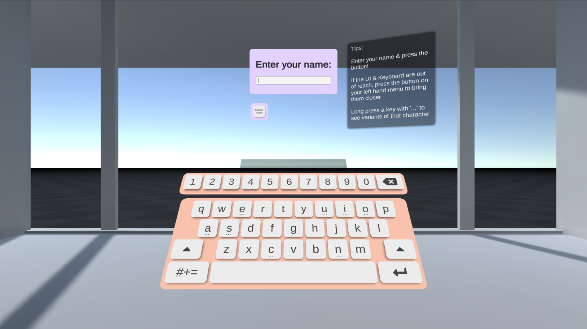

# XR Keyboard



XR Keyboard is a reusable, physical XR keyboard that is built to be used with Unity, Leap Motion hand tracking & the Interaction Engine, in XR. The keyboard is built to be easy to use for short string entry, such as usernames, passwords, email addresses & search queries.

## Dependencies

- Leap Motion Core Assets <https://developer.leapmotion.com/unity>
- Interaction Engine <https://developer.leapmotion.com/unity>
- NaughtyAttributes <https://github.com/dbrizov/NaughtyAttributes>
- TextMeshPro

## Getting Started

### Set Up The Keyboard

1. Ensure you have Leap & the Interaction Engine set up in your scene
2. Place the `QwertyKeyboard` prefab into the scene

### Set Up Input Fields

1. Add `TMPInputFieldTextReceiver` to any text fields you want the keyboard to input to (note: only compatible with TextMeshPro InputFields)

## Customisation

The keyboard is an editable set of panels defined by prefabs & keymaps.
There are two main panels - Alphanumeric & Symbols, which are each defined by a keymap, a prefab for the key & a prefab for the key's shadow.

These two panels can be found here:

`QwertyKeyboard/Parent/AlphaNumericPanel`

`QwertyKeyboard/Parent/SymbolsPanel`

### Customising Looks

Most of the customisation for each panel can be done on the `DefaultKey` prefab - here you can change the

- Image used for the key
- Text Mesh
- Interaction Button colour (`SimpleInteractionGlowImage`)
- Interaction Glow colour (`SimpleInteractionGlowImage`)
- Sound Effects (`InteractionButtonSounds`)

In addition to this you can change the shadow design by changing the `DefaultShadow` prefab.

Once happy with your new design, select your panel & press `Regenerate Keyboard` to generate a new keyboard panel prefab with your new design. You can choose for this to overwrite the current keyboard prefab you're working on by setting the `Over Write Prefab` option to **true**.

If you choose to use a new key or shadow prefab, you must update the prefab fields on the AlphaNumeric, Symbols and AccentKeys panels to reference your new prefab.

Key, panel and gap size can be changed on the `UI Keyboard Resizer` component on your panel. This tool allows us to set the default size of a key & panels independently of the scale of the gameobject. Change the values on this object and press `Resize Keyboard` to apply your changes.

 ***Note:*** pressing `Regenerate Keyboard` on the `Key Map Generator` also triggers the `Resize Keyboard` function.

### Generating New Keyboard Prefabs

The `KeyMapGenerator` component provides the ability to automatically generate new keyboard layouts based on:

- A prefab for the individual keyboard key
- A prefab for the shadow of the key
- A Key Map that defines what keys are placed on each row of the keyboard

Open up one of prefabs and look at the panel object for an example of how to configure the `KeyMapGenerator`.

You can choose whether to overwrite or generate new keyboard prefabs when you regenerate, just check the box if you want to overwrite your current keyboard.

### Key Maps

Key maps can be saved and loaded from JSON files to allow for extending the keyboard in built apps. The `DefaultKeyMap` component provides a button that will create a new JSON file, placing it in `StreamingAssets`. This can be used as a template for new key maps.

Add a `JSONKeyMap` component to an object in the scene, give it a path to a JSON file and then `LoadFromJSON` using the button provided. You can then modify the map in the Inspector and save it as a new key map.

Note: A Keymap **must** have five rows defined in it.

## Known issues

- The Max Font Size in can get lost in the prefabs. If the characters look small, edit the max font size in the InteractionButtonUIKey prefab
- Occasionally the keyboard may lose its layout if Unity is not the active window - clicking into the Unity scene resolves this
- The prefab link for the key is lost on keyboard generation. Whenever you change the key prefab and want the changes to apply to your keyboard, you must hit regenerate.
- `InteractionButton`'s `pressedAmount` reports inaccurately - there's something funky going on with the physics & Unity's UI system. This can currently be worked around by doing the following:

```float newPressedAmount = Mathf.Lerp(0, 1, Mathf.InverseLerp(0.01f, 1.0f, interactionButton.pressedAmount));```

## Disclaimers

XR Keyboard is licensed under [Apache 2.0](LICENSE.txt)

XR Keyboard is not actively maintained or managed, and provided as is. Changes and fixes have no ETA.

XR Keyboard was built with 2019.4.18f1 & Leap Motion Unity Modules 4.8.0. We cannot guarantee that it will work with other versions of the modules or Unity.

XR Keyboard includes audio from two soundpacks sourced from [kenney.nl](www.kenney.nl). Both soundpacks are licensed under the [CC0 1.0 Universal Licence](https://creativecommons.org/publicdomain/zero/1.0/)
